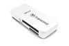
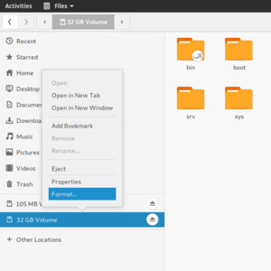
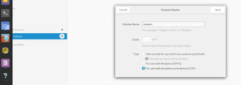
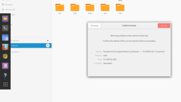

Load ethoscope software
==============================================

### Materials

* SD card model: SAMSUNG EVO 32 GB
* **.img** file containing the OS snapshot you want to flash. Lab default is   YYYYMMDD_ethoscope.img. 
<Be sure that the image file is in the right directory i.e. copy this file to desktop>
* USB-SD card adaptor


 
 


### Protocol 

1.- [Format SD Card](#format-sd-card)
2.- [Flash new image](#flash-new-image)
3.- [Fine tune settings](#fine-tune-settings)


### Format SD card

In the main computer (node)

1.- Introduce the SD card in the adapter and the adapter in a frontal USB port.

2.- Open the file explorer. The sdcard should appear as a mounted device on the left bar. Every partition present in the sdcard (possibly more than 1) will be listed there. Steps 3, 4 and 5 need to be repeated for all partitions (usually 2 max).

3.- Right click on the partition element and select format 
 
4.- Enter a random name (it wil be gone anyway) and leave the defaults, as listed in the image below. Click next. These are the settings for the formatting operation.

 

5.- Confirm the operation by clicking format
 

6.- Once 3, 4 and 5 are done for all partitions, extract the adapter without unmounting.

7.- Done!

---------------------------------------------

### Flash new image

In the main computer (node)

##### 1.- Become superuser by entering su and the password

```
su 
```

##### 2.- Find the sd card by listing the partitions available to the computer
```
fdisk -l
```
Usually it is assigned device /dev/sda. You can tell it is the scard because the memory size will be around 32 GB, like below: 
Disk /dev/sda: 29.8 GiB, 32010928128 bytes, 62521344 sectors
One of the lines in the output will look like this, and you need to check which letter goes after sd. In this case, it was assigned /dev/sda therefore it is a.

##### 3.- Flash the image to the correct partition (learned with #2)
Very careful with dd. You want to write on the correct partition!
dd takes arguments if, of (Input and Output File) and bs (Block Size). Not bullshit ;)
- if should be the input image_file.img
- of should be the address of the partition, /dev/sda in this case
- bs is set to 64 as this works fine in a decent amount of time, around 15 minutes. Come back in a few mins
```
dd if=/home/node/Desktop/20181218_ethoscope.img of=/dev/sda bs=64K
```
Notes of the image: Sayed from Scratch , mysql was modified to be worked - the latest files in github.
To assign right to account mysql using the foollwowing command # ``chown -R mysql /var/lib/mysql`` then tracking & saving data is possible. 

---------------------------------------------


### Fine tune settings
 
This step is required to bring an identity to the ethoscope we are making. You should have an identity available for the device (a number). Doing this requires changing 4 files in the /etc dir of the ethoscope filesystem i.e. on the sdcard! Open with  `nano` in being superuser (root) each file and edit it according to instructions.
 
##### 1.- /etc/machine-id
 
Change XX to reflect the ID. i.e if you are doing ethoscope 10, replace XX with 10
  `0XXe27SL5a9e19f94de287e28f789825`
  
##### 2.- /etc/machine-name

Same here
`ETHOSCOPE_0XX`
##### 3.- /etc/hostname

And here
`eXX`

##### 4.- /etc/dhcpcd.conf
Add the following lines to the end of the file, and change YY to the ending of the IP address.
Put a 2digit number, not necessarily the same as the id, that has not be taken already. You can see which numbers are taken on the `/home/node/Desktop/manual/list of ethoscope_ip_mac address.gnumeric`file available in the node computer.

```
interface wlan0

static ip_address=192.169.123.YY/24
static routers=192.169.123.254
static domain_name_servers=192.169.123.254
``` 
 
 
### Making a new image (based on previous)

1.- Take a working ethoscope's sdcard whose files have been changed. For example some parameters in the python scripts could have been modified by the lab.

2.- Become superuser
3.- Repeat the `fdisk -l` operation to learn where the sdcard is mounted

4- Run
`dd bs=64k if=/dev/sdX of=/home/node/Desktop/YYYYMMDD_ethoscope.img`
where X is the letter as found out in #3 and YYYYMMDD is the current date 


### Testing

The simple way to test your machine is to *plug a screen* add boot your new SD card.

